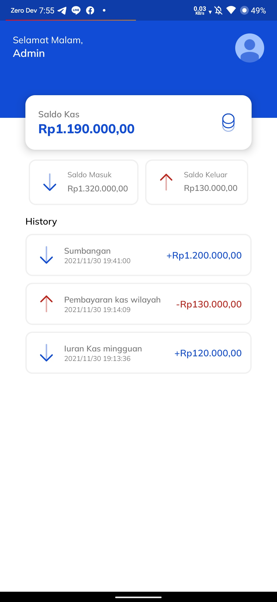
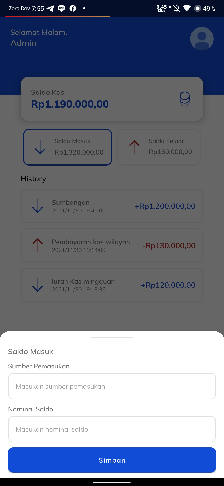
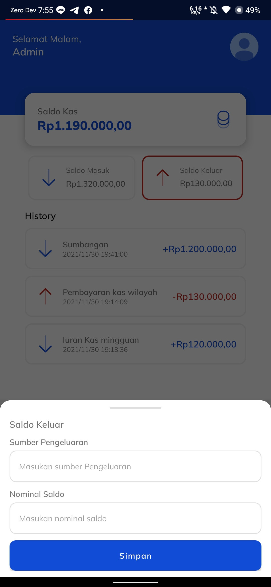

# Kas-Kita
Application to record the history of income and expenditure of money in an organization. 

# Screenshot
Home             |  Input Income  | Input Expenditure
:-------------------------:|:-------------------------: |:-------------------------:
  |    |  
# Download
You can download via the link <a href="https://github.com/akbarabdul80/Kas-Kita/releases/download/v1.0/Kas.Kita.V.1.0.apk">here</a>
